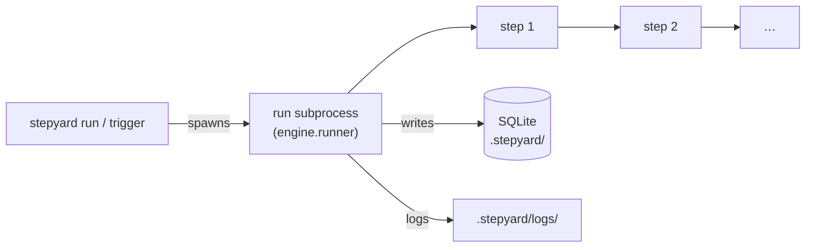
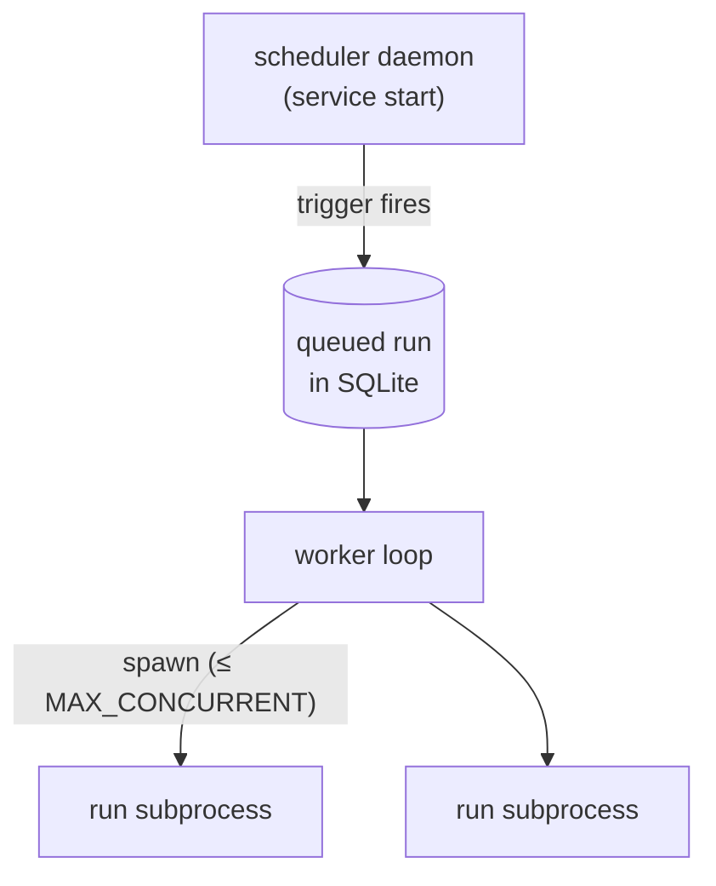
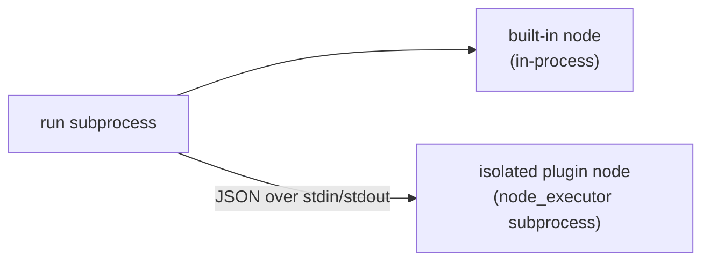

# Execution model

Each `stepyard run` (or scheduler-triggered run) is a separate OS process. Built-in nodes run inside that process; plugin nodes run in a short-lived child subprocess.

## Every run is its own OS process

When a flow runs - whether you typed `stepyard run <flow>` or a trigger fired it -
Stepyard spawns a brand-new operating-system subprocess for that single run:

```
python -m stepyard.engine.runner --run-id <id> --flow-file <path> --project-dir <dir>
```

That subprocess loads the flow, executes its steps, records progress in the
local SQLite database, and exits. Its stdout/stderr are captured to a log file
under `.stepyard/logs/`.



Because each run is its own process:

- A crash, uncaught exception, `sys.exit()`, segfault, or memory blow-up in one
  run **cannot** take down the scheduler or any other run.
- Per-run resource limits (CPU/memory) and timeouts can be enforced at the
  process boundary.
- Two runs of the same or different flows are fully independent.

## The scheduler and the worker

`stepyard service start` launches a long-lived **scheduler daemon** (a separate
process from your shell). It does two things:

1. **Evaluates triggers.** `cron`/`interval`/`startup` schedules and
   event-stream triggers are watched here. When one fires, the daemon writes a
   `queued` run into SQLite (optionally with a `trigger.payload`).
2. **Runs a worker loop** that picks up queued runs and spawns one run
   subprocess per run, up to `STEPYARD_MAX_CONCURRENT_FLOWS` (default `4`) at a
   time.



So in production there is one daemon process plus *N* short-lived run
subprocesses - never threads sharing state.

## Steps and node isolation

Inside a single run subprocess, steps execute **sequentially** on one asyncio
event loop. How a step's node runs depends on where the node comes from:

- **Built-in nodes** (`shell.run`, `http.request`, `llm.generate`, …) run
  in-process within the run subprocess. (Note that `shell.run` itself launches
  the command as a further child process.)
- **Plugin nodes installed into an isolated virtualenv** run in a *second*,
  short-lived subprocess:

  ```
  <plugin-venv>/python -m stepyard.core.node_executor
  ```

  Inputs are sent as JSON over stdin and the `NodeResult` comes back as JSON on
  stdout. This is what lets a plugin pin its own dependencies without ever
  clashing with Stepyard's.



## What this means for you

- **State is not shared between steps via Python globals.** Pass data forward
  with expressions: `${{ steps.<id>.output }}`.
- **Suspended runs exit cleanly.** When a step needs approval or human input,
  the run subprocess records `waiting_for_approval` / `waiting_for_input` and
  exits with code `0`; a later command resumes it as a fresh subprocess.
- **`stepyard replay` is different.** It re-executes a run **in-process** via
  `Engine.execute_run`, reusing stored outputs from steps before `--from-step`.
  Only `stepyard run` (and scheduler-triggered runs) use the `engine.runner`
  subprocess model above.
- **`print()` inside an isolated plugin node won't corrupt results** - stdout is
  redirected so only the JSON result travels back to the parent. Use the
  injected logger (`ctx.log`) for diagnostics.

## Related settings

| Environment variable | Default | Effect |
|----------------------|---------|--------|
| `STEPYARD_MAX_CONCURRENT_FLOWS` | `4` | Max run subprocesses the worker spawns at once |
| `STEPYARD_SCHEDULER_TICK` | `5` (s) | How often the daemon re-evaluates triggers |
| `STEPYARD_EXECUTOR_TICK` | `2` (s) | How often the worker polls the run queue |
| `STEPYARD_MAX_STEP_VISITS` | `1000` | Safety cap on step re-visits (graph loops) |
